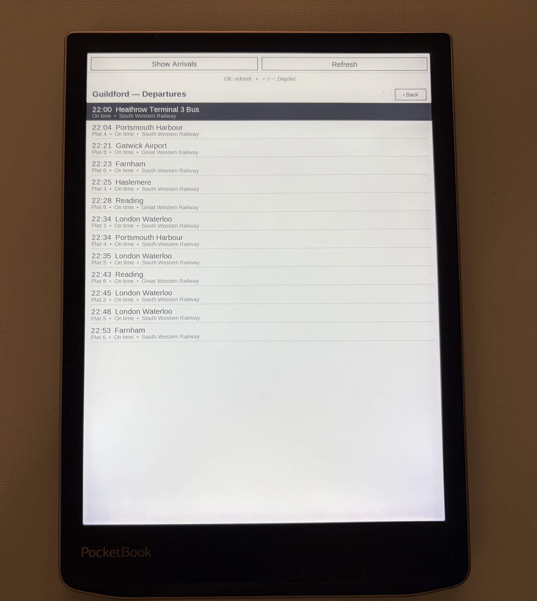

# InkStation (why not?)


Native PocketBook app showing live UK train **Departures** and **Arrivals** from the [Realtime Trains](https://www.realtimetrains.co.uk/) API. Runs on stock firmware via the official InkView SDK — no KOReader, no jailbreak.

## Screenshots



*Live Guildford departures on a PocketBook, straight from the Realtime Trains API.*

## Features

- Offline station search — 2 600+ GB National Rail stations bundled, no network needed to find a station
- Live departure and arrival boards (time, destination/origin, platform, expected time, operator)
- Toggle between Departures and Arrivals in one tap / one key press
- Refresh button + hardware OK key
- WiFi keep-alive: recovers silently from firmware idle-timer power-downs
- On-screen Back button (works on touch-only PocketBook models)

## Requirements

- PocketBook e-reader with stock firmware (tested on InkView SDK 6.3.0 target)
- A [Realtime Trains **Next Generation** API](https://api-portal.rtt.io/) token (sign up at the API portal). This is a Bearer **refresh token** (a JWT); InkStation exchanges it for a short-lived access token automatically. (Note: this is *not* the older `api.rtt.io/api/v1` Basic-auth API — that one is not used.)

## Build

Cross-compile with the [PocketBook SDK 6.3.0](https://github.com/pocketbook/SDK_6.3.0) (`6.5` branch → `SDK-B288/`). The toolchain binaries are Linux x86_64 only.

```bash
cmake -B build \
      -DCMAKE_TOOLCHAIN_FILE=cmake/toolchain-arm-obreey.cmake \
      -DPB_SDK_ROOT=/path/to/SDK-B288
cmake --build build
# Produces: build/inkstation.app
```

## Deploy

`deploy.sh` is a one-command **pull → build → install** for the device, with a
flag to choose wired (USB) or wireless (WiFi). It defaults the project dir to its
own location and the SDK to `$PB_SDK_ROOT` (or `~/pocketbook-sdk/SDK-B288`).

```bash
./deploy.sh                            # wired: build + copy over USB (default)
./deploy.sh --usb --pull               # git pull, clean rebuild, copy over USB
./deploy.sh --wifi --find              # wireless: build + install to auto-detected device
./deploy.sh --wifi --ip 192.168.1.42   # wireless: build + install to a known IP
./deploy.sh --build-only               # just cross-compile, don't install
```

Or via the `Makefile`: `make deploy`, `make deploy-wifi IP=...`, `make build`, `make test`.

### Wired (USB)

1. Connect the reader over USB and allow storage access on the device.
2. `./deploy.sh --usb` — builds, then copies `build/inkstation.app` into the
   device's mounted `applications/` folder (auto-detected under `/media/$USER/*/`).
3. Safely eject, then launch **InkStation** from the Applications menu.

### Wireless (WiFi)

The wireless mode installs over the network. You must first set up a **WiFi drop
point** on the reader — this is what receives the binary:

> **Set up the drop point first.** Install [**inkshelf**](https://github.com/N-Combinator/inkshelf)
> on the reader and open its **WiFi Book Drop** screen — that is the WiFi-drop
> server InkStation deploys through (it advertises over mDNS so `--find` can
> locate the device). See the inkshelf README for setup and the PIN.

Two methods:

```bash
# (default) SCP the binary to applications/inkstation.app and relaunch.
# Installs InkStation as its own app. Needs sshd on the reader (PocketBook
# jailbreak / PBJB sshd).
./deploy.sh --wifi --find            # or: --ip <device-ip>
./deploy.sh --wifi --ip 192.168.1.42 --ssh

# Push to inkshelf's WiFi-drop HTTP endpoint (parity with inkshelf's tooling).
./deploy.sh --wifi --http-drop --ip 192.168.1.42 --pin 1234
```

> **`--http-drop` caveat.** inkshelf's `/deploy` endpoint writes the upload to
> `applications/inkshelf.app` (it is inkshelf's own self-update path), so it
> **replaces inkshelf** with the InkStation binary rather than installing a
> separate `inkstation.app`. To run InkStation *alongside* inkshelf, use the
> default `--ssh` method (or install once over USB). `--http-drop` is provided
> for parity with inkshelf's deploy tooling.

## Manual installation

If you prefer not to use `deploy.sh`: copy `build/inkstation.app` to the
PocketBook SD card under `applications/`, eject, and launch **InkStation** from
the Applications menu.

## Configuration

InkStation reads its RTT API token at startup from the on-device config file:

```
/mnt/ext1/system/config/inkstation.conf
```

containing one line:

```
rtt_refresh_token=<your RTT API token>
```

This is the RTT Next Generation API **refresh token** (a Bearer JWT, `eyJ...`)
from [api-portal.rtt.io](https://api-portal.rtt.io/). InkStation exchanges it for
a short-lived access token at runtime and caches it. The token is stored only on
the device and is **never committed to the repo or baked into the binary**. If it
is missing, station boards show *"No RTT token set"*.

### Provisioning the token (recommended)

`deploy.sh` writes the config file to the device for you, so you don't have to
create it by hand. Supply the token one of three ways (checked in order):

```bash
./deploy.sh --usb --rtt-token 'eyJ...'      # explicit flag
RTT_TOKEN='eyJ...' ./deploy.sh --usb         # environment variable
echo 'eyJ...' > rtt_token.txt && ./deploy.sh --usb   # gitignored local file
```

`rtt_token.txt` is in `.gitignore` and never leaves your machine. The same
applies to `--wifi --ssh` deploys (the token is written over SSH). The
`--http-drop` method cannot write the token — set it via USB/SSH or by hand.

### By hand

Alternatively, create `/mnt/ext1/system/config/inkstation.conf` on the SD card
yourself with the `rtt_refresh_token=...` line above.

### Regenerating the station list (developer only)

```bash
RTT_REFRESH_TOKEN='<token>' python3 tools/gen_stations.py > src/stations.h
```

## Usage

1. Launch InkStation — a station search screen opens.
2. **Tap the search bar** (or press OK) to type a station name. Results filter as you type over 2 600+ GB National Rail stations.
3. **Tap a station** (or navigate with arrow keys + OK) to open its live board.
4. On the board screen:
   - **"Show Arrivals" / "Show Departures"** button or ← / → keys to toggle mode
   - **"Refresh"** button or OK key to reload from the API
   - **Back** button or Back key to return to search

## Host parser tests

The RTT JSON parser (`rtt_parse`) can be tested on the build host without the PocketBook SDK:

```bash
bash tests/run_host_tests.sh
```

Requires GCC with AddressSanitizer/UBSanitizer (standard on Linux).

## Project structure

```
src/
  main.c          InkView entry point
  app.c/h         Navigation stack
  ui.c/h          Drawing helpers, list widget, key classification
  config.c/h      On-device key=value settings store
  rtt.c/h         Realtime Trains API client (token auth + board parser)
  screens.c/h     Station search and live board screens
  http.c/h        libcurl GET wrapper (WiFi retry, logging)
  net.c/h         WiFi keep-alive for PocketBook firmware
  cJSON.c/h       Embedded JSON parser
  stations.h      Bundled offline GB National Rail station list (generated)
cmake/
  toolchain-arm-obreey.cmake   PocketBook cross-compile toolchain
tools/
  gen_stations.py   Regenerates stations.h from the RTT API
tests/
  test_rtt.c        rtt_parse unit tests (host, no SDK needed)
  run_host_tests.sh Test runner
deploy.sh           one-command pull/build/install (USB or WiFi)
Makefile            convenience targets wrapping deploy.sh
```
